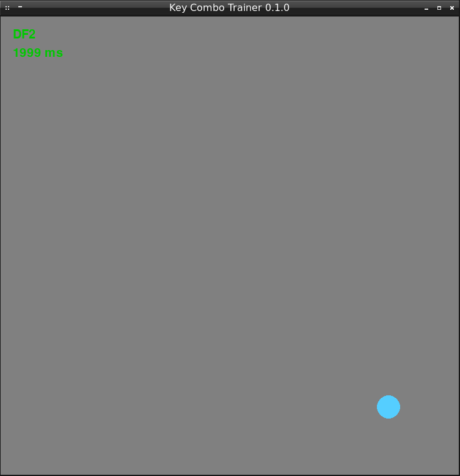

# Key Combo Trainer 0.1.0 version

This is the key combo trainer for League of Legends and Dota 2 players.

A current development state is available in the [`CHANGELOG.md`](CHANGELOG.md) file.

## Installation

You need Python 3, PyGame and dataclasses modules for launching the Key Combo Trainer.

### Windows

These are steps to install Key Combo Trainer on Windows:

1. Download the Python 3 distribution and install it:<br/>
https://www.python.org/downloads/release/python-373/

2. Install the `pygame` module:<br/>
`python -m pip install pygame`

3. Install the `dataclasses` module:<br/>
`python -m pip install dataclasses`

4. Download the archive with Key Combo Trainer and extract it:<br/>
https://github.com/ellysh/key-combo-trainer/archive/master.zip

### Linux

These are steps to install Key Combo Trainer on Linux:

1. Install the Python 3:<br/>
`sudo apt-get install python3`

2. Install the pip package manager:<br/>
`sudo apt-get install python3-pip`

3. Install the PyGame module:<br/>
`pip3 install pygame`

4. Install the dataclasses module:<br/>
`pip3 install dataclasses`

5. Download the archive with Key Combo Trainer and extract it:<br/>
https://github.com/ellysh/key-combo-trainer/archive/master.zip

## Usage

Launch the `key-combo-trainer.py` script in the `key-combo-trainer` directory to start the Key Combo Trainer. The main window of the trainer looks like this:



The window on the screenshot has three elements:

1. The **DF2** text in the upper-left corner of the window. This is the key combo that you should press as fast as possible.

2. The **1999 ms** text is the time that you spend by pressing the previous key combo.

3. Blue point in the bottom-right corner of the window. This is the place where you should put the mouse cursor before pressing the key combo.

Here are steps to use the trainer:

1. Put the mouse cursor on the blue point.

2. Press the key combo from the upper-left corner of the window.

3. Check how fast are you with the time estimation in the upper-left corner of the window.

4. Practice more to react and press combos as fast as possible.

## Configuration

The Key Combo Trainer generates the key combos randomly. You can change the keys in these combos and their length. Here are the steps to do that:

1. Open the `model.py` script in the code or text editor.

2. Find the following lines:
```Python
_KEY_SYMBOLS = "123aqwerdf"
_KEY_LENGTH_MIN = 2
_KEY_LENGTH_MAX = 4
```

3. Put the keys that you need in the `_KEY_SYMBOLS` string. Now the string equals "123aqwerdf".

4. Specify the minimum combo length in the `_KEY_LENGTH_MIN` variable. Now it equals 2.

5. Specify the maximum combo length in the `_KEY_LENGTH_MAX` variable. Now it equals 4.

6. Save the `model.py` file and close it.

Now the Key Combo Trainer generates key combos that you need.

## Update

If you need to update the Key Combo Trainer to the latest release, download and extract the new archive from GitHub. Check details in the "Installation" section of this README file.

## Contacts

If you have any suggestions, bug reports or questions about usage of the Key Combo Trainer, please contact me via email petrsum@gmail.com.

## License

This project is distributed under the GPL v3.0 license
